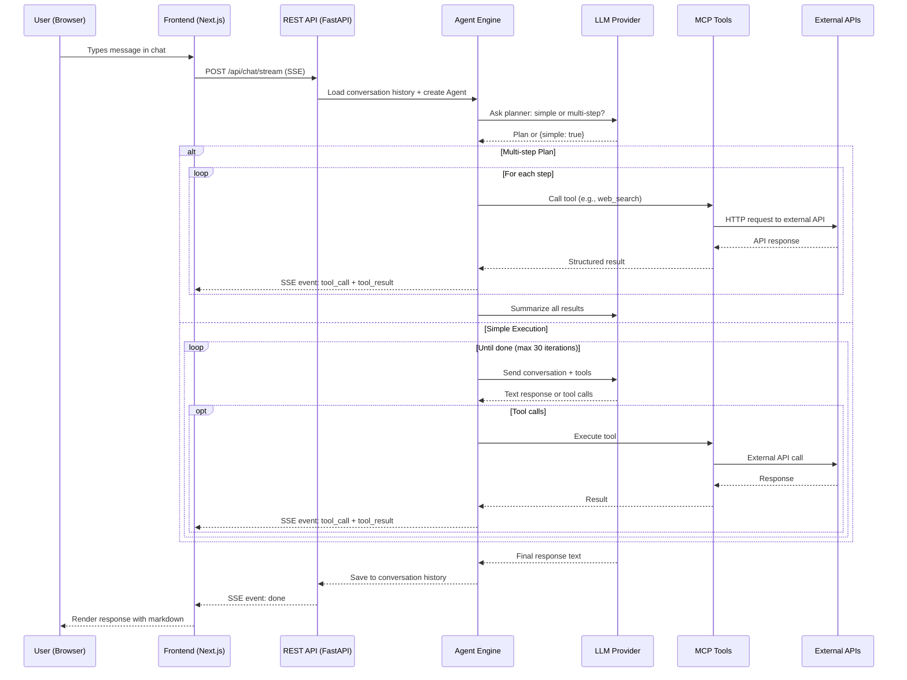

# OpenPA — Personal Assistant-as-a-Service

OpenPA is an open-source, multi-tenant Personal Assistant platform that decomposes PA capabilities into independent, API-driven services. It orchestrates 14+ services through a unified chat interface powered by an intelligent agent with multi-step planning, code execution, and self-evolution capabilities.

Built for the Cloud Computing course project exploring **PA-as-a-Service** — where scheduling, task management, communication, and development workflows are decomposed into independent services communicating via well-defined RESTful API calls.

## Architecture

```
                           +------------------+
                           |   Next.js 16     |
                           |   Frontend       |
                           |  (React 19 +     |
                           |   TailwindCSS)   |
                           +--------+---------+
                                    |
                              SSE + REST
                                    |
                           +--------v---------+
                           |   FastAPI         |
                           |   REST API        |
                           |  /api/chat/stream |
                           |  /api/config      |
                           |  /api/auth        |
                           +--------+---------+
                                    |
                  +-----------------+------------------+
                  |                                    |
          +-------v--------+                +----------v----------+
          |  Agent Engine   |                |   Auth + DB Layer   |
          |                 |                |                     |
          |  Plan-then-     |                |  JWT Auth           |
          |  Execute or     |                |  SQLite (aiosqlite) |
          |  Simple Loop    |                |  Per-user creds     |
          |                 |                |  Conversation store |
          +-------+--------+                +---------------------+
                  |
          +-------v--------+
          |  LLM Providers  |
          |                 |
          |  Gemini 2.5     |
          |  Claude         |
          |  OpenAI / GPT   |
          |  Ollama (local) |
          |  OpenRouter     |
          +-------+--------+
                  |
          +-------v-----------------------------------------+
          |              MCP Tool Server (FastMCP)           |
          |                                                  |
          |  +--------+ +--------+ +----------+ +--------+  |
          |  | Gmail  | | GitHub | | Calendar | |Spotify |  |
          |  +--------+ +--------+ +----------+ +--------+  |
          |  +--------+ +--------+ +----------+ +--------+  |
          |  |Discord | |Telegram| | Mastodon | |  RSS   |  |
          |  +--------+ +--------+ +----------+ +--------+  |
          |  +--------+ +--------+ +----------+ +--------+  |
          |  |YouTube | |Sandbox | |Scheduler | | Memory |  |
          |  +--------+ +--------+ +----------+ +--------+  |
          |  +----------+ +------------+                     |
          |  |Web Search| |Web Scrape  |                     |
          |  +----------+ +------------+                     |
          +--------------------------------------------------+
                  |
          +-------v--------+
          |  External APIs  |
          |                 |
          |  Google APIs    |
          |  GitHub API     |
          |  Spotify API    |
          |  Discord API    |
          |  Mastodon API   |
          |  Telegram MTProto|
          |  DuckDuckGo     |
          |  yt-dlp         |
          +----------------+
```

## Data Flow



## Design Decisions

### 1. MCP-Based Tool Architecture
Each service (Gmail, GitHub, Spotify, etc.) is a self-contained **MCP server** mounted into a composite server. This means:
- **Adding a new service** = create one Python file + register it
- **No coupling** between services — Discord doesn't know about Gmail
- **The agent discovers tools at runtime** via MCP's tool listing protocol
- **Self-evolution**: the agent can read its own tool files, generate new ones, and PR them

### 2. Plan-Then-Execute Agent
Rather than letting the LLM freely loop, complex requests go through a **planner** first:
- The planner outputs a JSON array of steps with `depends_on` for chaining
- Each step is either a **tool call** or **llm_generate** (for text composition)
- This prevents drift on multi-step tasks and makes execution predictable
- Simple requests bypass the planner entirely for speed

### 3. Multi-Provider LLM Support
Users choose their own LLM provider and API key:
- **Ollama** (local, free) as fallback — always available
- **Gemini**, **Claude**, **OpenAI**, **OpenRouter** for cloud providers
- Per-user API key storage — the server never stores provider keys server-wide
- Provider-agnostic `LLMProvider` interface — all providers implement `chat(messages, tools, system)`

### 4. Sandbox Code Execution
The agent can **write, verify, test, and push code**:
- `verify_python` / `verify_javascript` — syntax + lint checks without execution
- `run_python` / `run_javascript` — sandboxed execution with test assertions
- `run_and_export` — execute code that produces downloadable files (CSV, JSON, etc.)
- Pipeline: **generate -> verify -> test -> push** (mimics CI/CD)

### 5. Per-User Multi-Tenancy
- JWT authentication with per-user credential isolation
- Each user stores their own OAuth tokens and API keys
- Scheduled jobs, conversations, and preferences are user-scoped
- No shared state between users

## Features

### Service Integrations (14 services, 65+ tools)

| Service | Tools | Auth |
|---------|-------|------|
| **Gmail** | Read, search, send, reply emails | Google OAuth |
| **Google Calendar** | List, create, delete events | Google OAuth |
| **GitHub** | Repos, PRs, issues, branches, file read/write, create repos | GitHub OAuth |
| **Spotify** | Play, pause, search, playlists | Spotify OAuth |
| **Discord** | Read/send messages, list channels | Discord OAuth |
| **Telegram** | Read/send messages, search contacts | MTProto (phone auth) |
| **Mastodon** | Timelines, trends, post, search, notifications | Mastodon OAuth |
| **RSS** | Add/fetch feeds, digest | None |
| **Web Search** | DuckDuckGo search | None |
| **Web Scrape** | Fetch pages, extract tables, extract links | None |
| **YouTube** | Download videos, get video info | None (yt-dlp) |
| **Sandbox** | Run/verify Python & JS, multi-file test, export files | None |
| **Scheduler** | Schedule future tool calls, list/cancel jobs | None |
| **Memory** | Preferences, notes, search history | None |

### Cross-Service Workflows
Single prompts that chain multiple services:
- *"Analyze Mastodon trends, create a GitHub issue for the top trend, and email me a summary"*
- *"Search Wikipedia for gymnastics medal data, export as CSV, and post a summary to Discord"*
- *"Scaffold a React app in a new GitHub repo, test it in the sandbox, push to a branch, and open a PR"*

### Vibe-Coding
The agent autonomously writes code via GitHub API:
1. **Scaffold mode**: Create a repo from scratch, generate files, open a PR
2. **Feature mode**: Read existing code, create a branch, modify/add files, PR
3. **Self-evolution**: Modify OpenPA's own codebase to add new tools/features
4. **Test-before-push**: Verify and test code in the sandbox before pushing

### Task Scheduling
Schedule any tool call for future execution:
- *"Send Mom a Telegram message in 1 hour"*
- *"Email the report at 5pm"*
- Supports `delay_minutes` or absolute `run_at` datetime
- List and cancel scheduled jobs via chat or REST API

### Data Export Pipeline
Generate downloadable files from any data:
- Agent writes Python code to process data
- `sandbox_run_and_export` executes and captures output files
- Files served via `/api/download/sandbox/{id}` with auth
- Auto-cleanup after 20 minutes

## Getting Started

### Prerequisites
- Python 3.14+
- Node.js 22+
- [uv](https://docs.astral.sh/uv/) (Python package manager)

### Installation
```bash
make install
```

### Configuration
Copy the example env file and fill in your OAuth credentials:
```bash
cp backend/.env.example backend/.env
```

Required env vars for each service:
- **Google**: `GOOGLE_CLIENT_ID`, `GOOGLE_CLIENT_SECRET`
- **GitHub**: `GITHUB_CLIENT_ID`, `GITHUB_CLIENT_SECRET`
- **Spotify**: `SPOTIFY_CLIENT_ID`, `SPOTIFY_CLIENT_SECRET`
- **Discord**: `DISCORD_CLIENT_ID`, `DISCORD_CLIENT_SECRET`, `DISCORD_BOT_TOKEN`
- **Mastodon**: `MASTODON_CLIENT_ID`, `MASTODON_CLIENT_SECRET`, `MASTODON_INSTANCE_URL`

LLM API keys are configured per-user in the Settings page.

### Running
```bash
# Backend (port 8000) + Frontend (port 3000)
make backend   # terminal 1
make frontend  # terminal 2

# Or run individually
make backend
make frontend
```

### Testing
```bash
make test   # Backend pytest
make lint   # Frontend ESLint
```

## API Reference

The full API is available at `http://localhost:8000/docs` (Swagger UI) when the backend is running.

### Key Endpoints

| Method | Endpoint | Description |
|--------|----------|-------------|
| POST | `/api/auth/signup` | Create account |
| POST | `/api/auth/login` | Login, get JWT |
| GET | `/api/me` | Current user + connected services |
| POST | `/api/chat/stream` | Chat with PA (SSE streaming) |
| PUT | `/api/config/{service}` | Save service credentials |
| GET | `/api/tools` | List all available tools |
| POST | `/api/tools/{name}` | Call any tool directly |
| GET | `/api/scheduler/jobs` | List scheduled jobs |
| GET | `/api/download/{id}` | Download a file (YouTube/sandbox) |

## Tech Stack

- **Backend**: FastAPI, Python 3.14, SQLite, FastMCP, yt-dlp
- **Frontend**: Next.js 16, React 19, TailwindCSS 4, shadcn/ui, react-markdown
- **LLM**: Gemini 2.5, Claude, GPT-4o, Ollama, OpenRouter
- **Auth**: JWT + OAuth 2.0 (Google, GitHub, Spotify, Discord, Mastodon, Telegram MTProto)
- **Protocols**: MCP (Model Context Protocol), SSE (Server-Sent Events), REST
